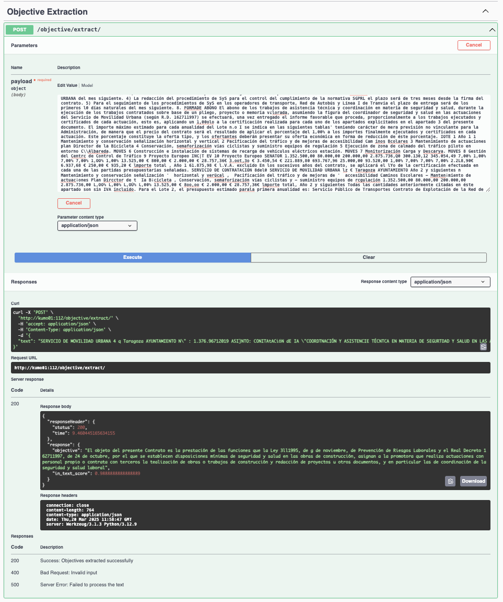

# NP-Text_Object

[](https://github.com/nextprocurement/NP-Text-Object/blob/main/LICENSE)

This project provides a module for extracting the "objective" from Spanish tenders, specifically from the "Pliegos de Condiciones Técnicas". Given raw text extracted from these documents, an LLM processes chunks of size 2000, starting from different tokens, and attempts to extract the objective. The best extraction is determined using an "in_text_score", calculated as:

$$\text{IN TEXT SCORE} = 0.5 \times J(A, B) + 0.5 \times P $$

where:
- \( J(A, B) \) represents the **Jaccard similarity** between the extracted objective (\( A \)) and the original text (\( B \)).
- \( P \) represents the **presence score** (i.e., whether the predicted objective appears in the text, usually as a binary or scaled value).

This provides a weighted combination of Jaccard similarity and presence in the text to determine the best-extracted objective.

For extraction, open-source LLMs are used. It is possible to use DSPy for extraction, which leverages optimized prompts based on annotated objectives, or a custom prompter class where we provide a template. DSPy was chosen as the primary method due to requiring less manual supervision.

**Note:** The algorithm does not guarantee that the "extracted objective" is always correct. Some extractions may not be fully relevant, but they generally contain thematic content useful for topic modeling.

---

## Main Scripts

### Objective Extraction

The objective extraction process is handled by `get_objective.py`. To execute it, run:

```bash
python get_objective.py --input <input_path> --output <output_path> --path_checkpoints <checkpoints_path> --col_extract <column_name>
```

Default arguments:
- `--input`: Path to the directory containing input files (default: `/export/data_ml4ds/NextProcurement/temporal/pt_to_extract`)
- `--output`: Path to the directory where extracted objectives are saved (default: `/export/data_ml4ds/NextProcurement/temporal/objectives_extracted_original`)
- `--path_checkpoints`: Directory for storing checkpoints (default: `/export/data_ml4ds/NextProcurement/temporal/checkpoints_original`)
- `--col_extract`: Column name containing text for extraction (default: `raw_textc`)

### Preprocessing for Topic Modeling

To preprocess the extracted objectives for topic modeling, use `nlp_preprocess.py`:

```bash
python nlp_preprocess.py --input <input_path> --output <output_path>
```

Default arguments:
- `--input`: Path to raw extracted objectives (default: `/export/usuarios_ml4ds/lbartolome/NextProcurement/NP-Text_Object/data/train_data/to_process`)
- `--output`: Path to save preprocessed objectives (default: `/export/usuarios_ml4ds/lbartolome/NextProcurement/NP-Text_Object/data/train_data/to_process`)

This script also calls an external preprocessing pipeline using `nlpipe.py` with the following parameters:
- **Source Path**: Path to the raw extracted objectives.
- **Source Type**: `parquet`
- **Source**: `pliegos`
- **Destination Path**: Output location.
- **Language**: `es`
- **SpaCy Model**: `es_dep_news_trf`
- **Embeddings Model**: `paraphrase-multilingual-MiniLM-L12-v2`
- **Flags**: `--do_embeddings --no_preproc`

---

## API Deployment

The objective extraction functionality is deployed in the [NP-Tools-API](https://github.com/nextprocurement/NP-Backend-Dockers) as an endpoint:

<p align="center">
  
</p>

---

## Preprocessing Instructions

1. **Add NLPipe Repository**
   
   Add the `NLPipe` repository as a submodule in the `src/preprocessing` directory:
   
   ```bash
   git submodule add https://github.com/Nemesis1303/NLPipe.git src/preprocessing/NLPipe
   ```

2. **Stopwords Placement**
   
   Ensure effective stopword removal by placing the stopwords file in `data/stw_lists/es`.

3. **Environment Setup**
   
   Create a separate virtual environment based on `src/preprocessing/requirements.txt` to avoid conflicts with dependencies used by the extraction module.

---

## Acknowledgements

This work has received funding from the NextProcurement European Action (grant agreement INEA/CEF/ICT/A2020/2373713-Action 2020-ES-IA-0255).

<p align="center">
  
  
</p>

